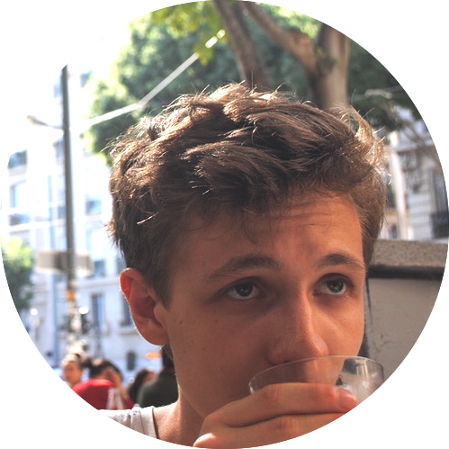

<!-- {:height="200px" width="200px"} -->

I am a recent Machine Learning MSc graduate at [UCL](https://www.ucl.ac.uk), working on publishing the findings from my thesis with [Prof. Mirco Musolesi](https://www.mircomusolesi.org) in the [Machine Intelligence Lab](https://www.machineintelligencelab.ai). Previously I was an undergraduate in Theoretical Physics at [Imperial College](https://www.imperial.ac.uk), where I completed my final year project with [Dave Clements](https://www.imperial.ac.uk/people/d.clements) in the [Astrophysics Group](https://www.imperial.ac.uk/astrophysics). I also spent a summer as a research intern under the supervision of [Mark van der Wilk](https://mvdw.uk) working on Causal Discovery and GPLVMs. I grew up in Budapest, Hungary.